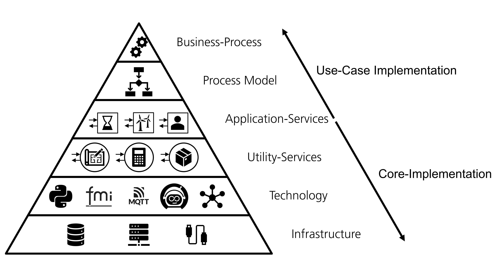
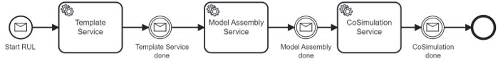
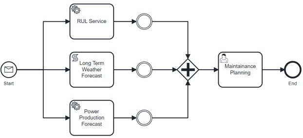

# DigiWind - Project repository
This project/repository holds code developed for the project **DigiWind**.


[](https://doi.org/10.5281/zenodo.8070953)


## The DigiWind Platform

The DigiWind Platform is a digital twin platform designed to meet the specific requirements of wind energy systems: being able to manage modular simulation models and assemble the simulations automatically. 

**This repository holds only the infrastructure for linking different simulation models and not the models itself!**

The diagram below shows the different architectural layers of the DigiWind platform:



Using the DigiWind platform always starts with a use-case or so-called process. This process is then translated into a process model with the Business Process Model and Notation (BPMN) which is a graphical specification language. For the process specific logic a combination of application services and [utility services](MicroServices) are used. The utility services enable the core functionality of the platform whereas the application services are implemented for a specific use case. Both services are using user specific simulation models saved as [Functional Mock-Up Interface Unit](https://fmi-standard.org/) (FMU) and their metadata stored in the [DigiWind ontology](DigiWindOntology). The management of FMU models can be done via the [FMUManager](FmuManager).

## Building an Application Service
Since every use-case is very different, it most likely requires use-case specific logic which is implemented in an application service. This could include functionality for linking utility services as shown below or specific calculations or preparations before executing the (co-)simulation.



## Uploading Simulation Models
After the simulation structure is defined and the application services are implemented, the required simulation models need to be uploaded. This can be done manually or with the [FMU Manager](FmuManager). Each simulation models must be uploaded as .fmu file with a corresponding metadata.json file. If you are not using the FMUManager, you have to create a metadata.json file manually and follow this schema:

    {
	"metaInformation": {
		"type": "ModelType",
		"identifier": "ModelIdentifier",
		"startOfValidity": "some_date",
		"referenceID": "1.0"
	},
	"signalBonds": {
		"somePort": {
			"type": "somePortType",
			"asFlow": "someFlow",
			"asEffort": "someEffort"
		}
	},
	"signals": {
		"someFlow": "fmu_signal_1",
		"someEffort": "fmu_signal_2"
	    }
    }


## Using an Application Service

After the implementation of the required application services and the upload of the simulation models, they can be used to describe the use-case with BPMN. The following example process model shows the use-case of reevaluating the current maintenance plan. For further information about BPMN have a look at [this documentation](https://github.com/DanielRamsauer/bpmnservice) from one of our contributors or at the [general documentation](https://www.bpmn.org/).



## Additional Information

### JSON arrays in Zeebe

The current [Verion](https://github.com/camunda-community-hub/zeebe-hazelcast-exporter/pkgs/container/zeebe-with-hazelcast-exporter) of Zeebe is not able to parse JSON arrays.
Therefore it is necessary to convert very array in to a string which is seperated by a special caracter.
For example, each entry of the array could be concatenated and seperated by a semicolon.
This makes it very easy to separate within every service.

As example an array with this structure

```json
{
    "simulationConfigs": [
        "<sim_1 as json-string>",
        "<sim_2 as json-string>",
        "<sim_3 as json-string>"
    ]
}
```

should be converted to the following string, in order to enable correct computation of Zeebe.

```json
{
    "simulationConfigs": "<sim_1 as json-string>;<sim_2 as json-string>;<sim_3 as json-string>"
}
```

### Environment file

The .env - file of the framework defines several varibales including the ``ONTOLOGY_URL``.
If the service is unable to generat a valid URL using this variable remove the quotes form the assigned value.
